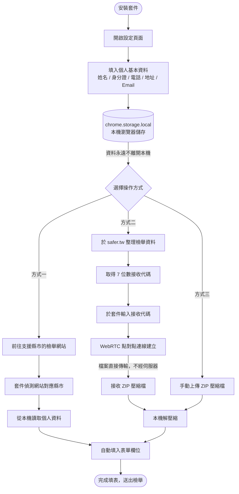
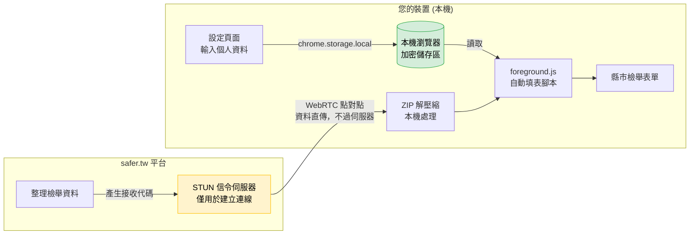
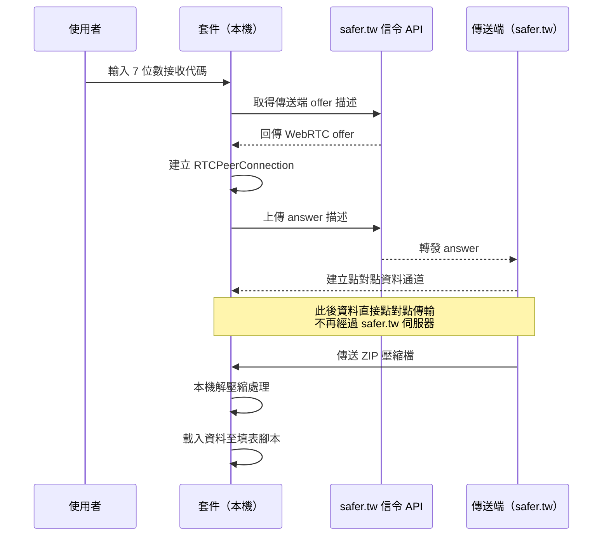

# SaferTW Traffic Extension

這個瀏覽器套件用於整合台灣各縣市的交通違規檢舉網站。

使用者可以在 [safer.tw](https://safer.tw) 平台編輯、整合檢舉資料，並一鍵傳送至各縣市的官方檢舉系統，提升檢舉流程效率。

> **隱私承諾**：本套件所有個人資料（姓名、身分證字號、電話等）**僅儲存於您的本機瀏覽器**，絕不上傳至任何外部伺服器。

## 主要功能
- 整合台灣各縣市交通違規檢舉網站自動填表功能
- 於 safer.tw 平台編輯檢舉資料
- 一鍵傳送至官方檢舉系統
- 支援 7 位數接收代碼透過 WebRTC 點對點傳輸檢舉資料
- 自動輸入檢舉者基本資料（讀取本機儲存設定）
- 支援壓縮檔案上傳解壓縮功能

## 目前支援縣市
以下縣市已支援交通違規檢舉系統自動整合（共 19 個縣市）：

台北市、新北市、桃園市、台中市、台南市、高雄市、基隆市、新竹市、嘉義市、新竹縣、苗栗縣、彰化縣、雲林縣、嘉義縣、屏東縣、宜蘭縣、花蓮縣、台東縣、澎湖縣

（如需新增其他縣市，歡迎提出需求或協助開發！）

## 使用流程圖

### 整體使用流程



### 資料流與隱私架構



> **注意**：safer.tw 的 STUN 信令伺服器僅用於協助兩端建立 WebRTC 連線（交換 IP 位址），**實際的檔案內容不會經過任何伺服器**，直接在您的裝置間點對點傳輸。

### WebRTC 檔案接收流程



## 技術特點
- 基於 Manifest V3 開發
- 支援 WebRTC 點對點檔案傳輸技術（資料不經伺服器）
- 自動識別各縣市檢舉系統並填入使用者資料
- 支援 ZIP 檔案本機解壓縮功能
- 具備 EXIF 資訊檢視功能
- 跨分頁檔案同步管理功能（BroadcastChannel）
- 個人資料使用 `chrome.storage.local` 本地儲存
- 支援 IndexedDB 技術

## 安裝方式
1. 下載本專案並解壓縮。
2. 開啟瀏覽器的擴充功能頁面（如 `chrome://extensions`）。
3. 開啟「開發者模式」。
4. 點選「載入未封裝項目」，選擇本專案資料夾。
5. 安裝完成後，點選套件圖示進行個人資料設定。
6. 前往各縣市檢舉網站即可自動填入資料。

## 使用說明
1. **首次設定**：點選瀏覽器工具列的套件圖示，填入個人基本資料（僅存於本機 `chrome.storage.local`，不會對外傳輸）
2. **自動填表**：前往支援的縣市檢舉網站，套件會自動讀取本機資料並填入表單
3. **WebRTC 檔案傳輸**：使用 7 位數接收代碼，可從 safer.tw 平台點對點直傳檢舉資料
4. **手動上傳**：也可手動上傳 ZIP 壓縮檔進行本機資料匯入

## 支援瀏覽器
本套件基於 Manifest V3 開發，支援所有基於 Chromium 的瀏覽器：
- Google Chrome（推薦）
- Microsoft Edge
- Brave Browser
- Vivaldi
- Opera

**注意**：Firefox 及 Safari 暫不支援

## 隱私保護與資料處理說明

本套件在設計上以「本機優先」為核心原則，以下說明各類資料的儲存與處理方式：

### 個人基本資料（姓名、身分證字號、電話、地址、Email）

| 資料項目 | 儲存位置 | 是否對外傳輸 |
|----------|----------|-------------|
| 姓名 | `chrome.storage.local`（本機） | ✗ 不會傳輸 |
| 身分證字號 | `chrome.storage.local`（本機） | ✗ 不會傳輸 |
| Email | `chrome.storage.local`（本機） | ✗ 不會傳輸 |
| 聯絡手機 | `chrome.storage.local`（本機） | ✗ 不會傳輸 |
| 通訊地址 | `chrome.storage.local`（本機） | ✗ 不會傳輸 |

- 資料透過 `chrome.storage.local` API 儲存，**完全封鎖在您的瀏覽器本機儲存區**，其他網頁或外部服務無法存取。
- 自動填表時，資料由套件直接讀取本機儲存並注入至表單，**全程不經過網路**。

### 檢舉檔案（照片、影片等）

- 透過 WebRTC 點對點（P2P）技術傳輸，**檔案內容直接在裝置間傳遞，不經過任何伺服器儲存或轉送**。
- safer.tw 的信令 API 僅傳遞 WebRTC 連線協商資訊（SDP/ICE），**不接觸任何檔案內容**。
- ZIP 解壓縮作業完全在您的瀏覽器本機執行，不上傳至任何雲端服務。

### 套件所需權限說明

| 權限 | 用途 |
|------|------|
| `storage` | 讀寫本機個人資料設定 |
| `host_permissions: *://*/*` | 在支援的縣市檢舉網站注入自動填表腳本 |

> 本套件不使用 `cookies`、`webRequest`、`history` 等追蹤型權限，僅申請自動填表所必要的最小權限。

## 專案結構
```
├── manifest.json              # 套件設定檔
├── service-worker.js          # 背景服務
├── service-worker-utils.js    # 背景服務工具函式
├── content-isolated.js        # 隔離環境腳本
├── foreground.js              # 主要功能腳本
├── popup/                     # 設定彈窗
├── settings/                  # 設定頁面
├── libs/                      # 第三方函式庫
└── logo/                      # 圖示檔案
```

## 版本資訊
- 當前版本：0.1.5
- 最後更新：2026年5月

## 聯絡與貢獻
如有建議或問題，歡迎於 GitHub 提出 issue 或 pull request。

更多資訊請參考：[safer.tw](https://safer.tw)
